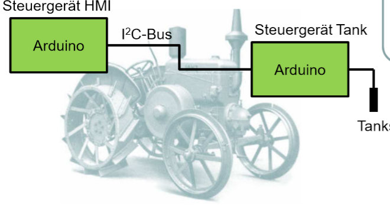

# sensor_control-device_I2C_Bus

## Auslese des I2C-fähigen Tanksensors von einem anderen Steuergerät

### Das Steuergerät HMI (Master) fordert den Tankfüllstand in regelmäßigen Abständen an und gibt ihn aus. Wenn das Tank-Steuergerät (Slave) angesprochen wird, schickt es den Tankfüllstand  zurück.
### Hierfür wird ein Poti zur Simulation verwendet.

